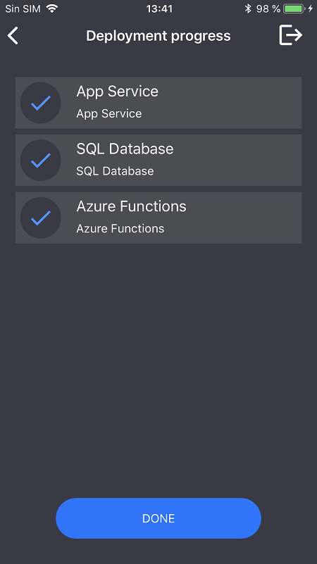
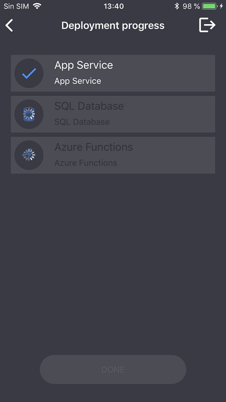
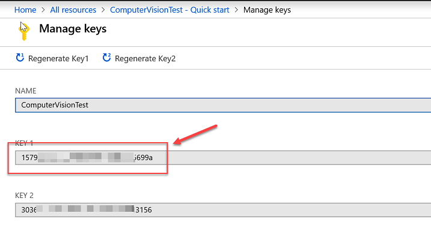

# AI Visual Provision

## Introduction

As part of Connect(); 2018 we released the AI Vision Provision. This sample app leverages the power of Azure Cognitive Services (Computer Vision and Custom Vision) to analyze Azure Service logos and handwriting in order to identify potential services and then deploy them to Azure all from the comfort of your phone.

Here is the YouTube URL of this app Demo during Connect 2018 
https://youtu.be/5_iE7azx7Vo?t=2154

The following services are currently supported:
* Azure Functions
* Azure Key Vault (handwriting only)
* Azure SQL 
* Azure Storage Account
* Azure Web Apps
* Azure Virtual Machine (Windows Server)

## Xamarin.Forms App (AI Visual Provision)

Xamarin.Forms enables you to build native UIs for iOS, Android, macOS, Linux, and Windows from a single, shared codebase. You can dive into app development with Xamarin.Forms by following our free self-guided learning from Xamarin University. This project exercises the following patterns and features:

* Xamarin.Forms
* XAML UI
* Converters
* Custom Controls
* Custom Renderers
* Data Binding
* Effects
* IoC
* MVVM
* Plugins for Xamarin
* Styles
* .NET Standard

## Screens

     

## Requirements

* [Visual Studio 2017 version 15.8 or Visual Studio for Mac version 7.7](https://www.visualstudio.com/vs/)
* Visual Studio tools for Xamarin
* Android Build Tools 27.0.3.

> You don't have to use the Azure Magnets for running this demo but in case you want to download the magnets are available in [here](Documents/).

## Getting Started

The mobile application uses Cognitive Services to detect Azure services using the phone camera. In order to use the application, you will need a pre-existing Azure subscription, a Custom Vision project for the Azure logo identification and a Computer Vision service for the optical character recognition.

### Service principal creation

The [Azure Fluent SDK] requires an [Azure Service Principal](https://docs.microsoft.com/en-us/azure/active-directory/develop/app-objects-and-service-principals) account to [authentication](https://github.com/Azure/azure-libraries-for-net/blob/master/AUTH.md) against a subscription in order to deploy services from the app.  
Therefore, you need to create a Service principal in order to work with this demo. You can do this either using Azure Cloud Shell or by using the Azure CLI directly:

Fist you need to log in and select the right subscription to work with

```
az login
az account list
az account set --subscription "<subscription name or subscription id>"
```

Create your Service Principal (note that it may take some time to complete):
```
az ad sp create-for-rbac --name <servicePrincipalName> --password <yourSPStrongPassword>
```

Upon successful completion, you should be presented with the following JSON output that contains the necessary credentials including the clientId and TenantId:

```
{
  "clientId": "(...)",
  "clientSecret": "(...)",
  "subscriptionId": "(...)",
  "tenantId": "(...)",
  ...
}
```
Take a note ofthe following details:

- `clientId`  
- `tenantId` 
- `clientSecret` i.e. your password.

### Computer Vision API Key

You need a Computer Vision service in order to use the handwriting recognition features of the app.
To create your own Computer Vision instance you can find instructions [in the Azure docs](https://docs.microsoft.com/en-us/azure/cognitive-services/computer-vision/vision-api-how-to-topics/howtosubscribe). 
Once you've provisioned the service, you can retrieve the your service endpoint URI and endpoint key as per the images below:




Finally, open the `MagnetsMobileClient\VisualProvision\AppSettings.cs` file and populate the `ComputerVisionEndpoint` and `ComputerVisionKey` variables with the right values settings.

### Azure Custom Vision - training the model

The in-app logo recognition is accomplished by using [Azure Custom Vision](https://azure.microsoft.com/en-us/services/cognitive-services/custom-vision-service/). In order to use the service in the app, you need to create a new Custom Vision project and train it with the images provided in the repo under the **documents/training_dataset** folder. If you've never used the Custom Vision service before, then you can follow this tutorial [here](https://docs.microsoft.com/en-us/azure/cognitive-services/custom-vision-service/getting-started-build-a-classifier) and there's a great [Channel9 video](https://channel9.msdn.com/Shows/AI-Show/Azure-Custom-Vision-How-to-Train-and-Identify-Unique-Designs-or-Image-Content) that shows you how to do it end-to-end.

If you have the Azure magnet sheets then this is the best and fastest way to train your Custom Vision project. If you don't have the magnets handy, we've included 2 PDFs ([sheet1](https://github.com/Microsoft/AIVisualProvision/blob/master/Documents/AzureMagnets1.pdf), [sheet2](https://github.com/Microsoft/AIVisualProvision/blob/master/Documents/AzureMagnets2.pdf)) with all our magnet logos in the **documents** section of this repo. 

Note that the Custom Vision project creation and model training are a one-off requirement and you wont need to do this work again unless you want to add a new logo. New images can be added to improve the models accuracy and this is the only case where retraining will be required.

> IMPORTANT! To further increase the prediction accuracy you may want to train the model using the same or as similar as possible conditions as your expected working environment.

When training the model, you should use following set of tags, as they are the expected tags in the application. Tags are located at `MagnetsMobileClient\VisualProvision\Services\Recognition\RecognitionService.cs` file.
```
private const string TAG_ACTIVE_DIRECTORY = "ACTIVE_DIRECTORY";
private const string TAG_APP_SERVICE = "APP_SERVICE";
private const string TAG_NOTIFICATION_HUBS = "NOTIFICATION_HUBS";
private const string TAG_MOBILE_APPS = "MOBILE_APPS";
private const string TAG_AZURE_SEARCH = "AZURE_SEARCH";
private const string TAG_AZURE_CDN = "CDN";
private const string TAG_AZURE_MACHINE_LEARNING = "MACHINE_LEARNING";
private const string TAG_AZURE_STORAGE = "STORAGE";
private const string TAG_IOT_EDGE = "IOT_EDGE";
private const string TAG_COSMOS_DB = "COSMOS_DB";
private const string TAG_COGNITIVE_SERVICES = "COGNITIVE_SERVICES";
private const string TAG_SQL_DATABASE = "SQL_DATABASE";
private const string TAG_MYSQL_CLEARDB_DATABASE = "MYSQL_CLEARDB_DATABASE";
private const string TAG_REDIS_CACHE = "REDIS_CACHE";
private const string TAG_APP_INSIGHTS = "APPLICATION_INSIGHTS";
private const string TAG_AZURE_FUNCTIONS = "AZURE_FUNCTIONS";
```

Once you've trained your model, you need to retrieve the API keys. The image below shows you how:


Use the settings highlighted in the image to populate the `CustomVisionPredictionUrl` and `CustomVisionPredictionKey` variables in the `MagnetsMobileClient\VisualProvision\AppSettings.cs` file.

### App Center

You can optionally add use App Center to build, test and distribute the sample app to your phone.
In App Center get keys for Android and iOS to enable telemetry and deployment statistics.
Add each key in `MagnetsMobileClient\VisualProvision\AppSettings.cs` file for `AppCenterAndroid` and `AppCenterIos` settings.

To learn more about App Center follow [this link](https://docs.microsoft.com/en-us/appcenter/).

## Licenses

This project makes use of some third-party assets with a license that requires attribution:

## MIT License

- [Xamarin Forms](https://github.com/xamarin/Xamarin.Forms): Microsoft Corporation
- [Xamarin Essentials](https://github.com/xamarin/Essentials): Microsoft Corporation
- [MediaPlugin](https://github.com/jamesmontemagno/MediaPlugin): James Montemagno
- [PermissionsPlugin](https://github.com/jamesmontemagno/PermissionsPlugin): James Montemagno
- [MS AppCenter SDK](https://docs.microsoft.com/en-us/appcenter/sdk/): Microsoft Corporation
- [Azure SDK for .NET](https://github.com/Azure/azure-sdk-for-net): Microsoft Corporation
- [Azure libraries for .NET](https://github.com/Azure/azure-libraries-for-net): Microsoft Corporation
- [Xamarin Custom Controls](https://github.com/DottorPagliaccius/Xamarin-Custom-Controls): DottorPagliaccius
- [AndroidSupportComponents](https://github.com/xamarin/AndroidSupportComponents): .NET Foundation Contributors

##### Other free licenses

- [Inter UI](https://github.com/rsms/inter): SIL OFL 1.1
- [Lottie](https://github.com/martijn00/LottieXamarin): Martijn van Dijk, Apache License 2.0

# Contributing

This project welcomes contributions and suggestions.  Most contributions require you to agree to a
Contributor License Agreement (CLA) declaring that you have the right to, and actually do, grant us
the rights to use your contribution. For details, visit https://cla.microsoft.com.

When you submit a pull request, a CLA-bot will automatically determine whether you need to provide
a CLA and decorate the PR appropriately (e.g., label, comment). Simply follow the instructions
provided by the bot. You will only need to do this once across all repos using our CLA.

This project has adopted the [Microsoft Open Source Code of Conduct](https://opensource.microsoft.com/codeofconduct/).
For more information see the [Code of Conduct FAQ](https://opensource.microsoft.com/codeofconduct/faq/) or
contact [opencode@microsoft.com](mailto:opencode@microsoft.com) with any additional questions or comments.
